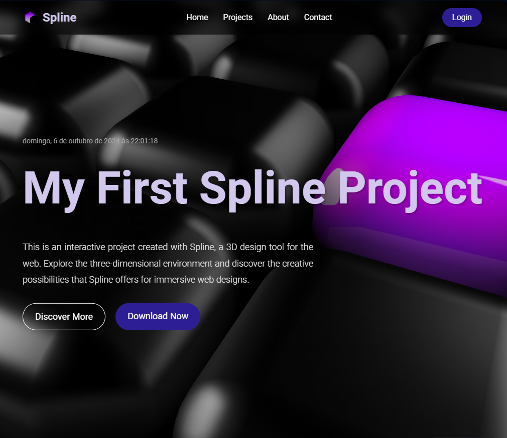

<!-- Projeto Finalizado -->
# 🎨 My First Spline Project
<p align="center">
  <!-- Contador de linguagens do GitHub -->
  
  <!-- Tamanho do repositório no GitHub -->
  
  <!-- Licença do GitHub -->
  
</p>

<div align="center">
  
</div>

## 📋 Sobre o Projeto
Este projeto é um ambiente 3D interativo desenvolvido usando o Spline, uma plataforma de criação de experiências 3D online.  Ele foi criado como um primeiro passo na exploração do Spline e da criação de cenários interativos.

## 🚀 Funcionalidades
- **Ambiente 3D Interativo:** Explore um mundo tridimensional com navegação intuitiva e animações. 
- **Interface Responsiva:** Desfrute da experiência em diferentes dispositivos, como desktops, tablets e smartphones.
- **Experiência Imersiva:** Mergulhe em um ambiente visualmente atraente com efeitos de iluminação e textura.

## 🛠 Tecnologias
- **Spline:** Utilizado para construir o ambiente 3D e definir a interatividade. [Acesse o site do Spline aqui](https://spline.design/).
- **JavaScript:** [Aprenda JavaScript com a MDN](https://developer.mozilla.org/pt-BR/docs/Web/JavaScript).
- **HTML5:** [Aprenda HTML5 com a MDN](https://developer.mozilla.org/pt-BR/docs/Web/HTML).
- **CSS3:** [Aprenda CSS3 com a MDN](https://developer.mozilla.org/pt-BR/docs/Web/CSS).

## 🌐 Visualize
Você pode visualizar o projeto online através deste [link](https://devandreotti.github.io/my-first-spline-project/).

## 📂 Estrutura do Projeto
```
├── src/                    
│   ├── css/                
│   ├── img/                
│   └── js/                 
├── index.html              
└── README.md
```

## 🕹️ Experimente
1. **Clone o repositório:**
   ```bash
   git clone https://github.com/devAndreotti/my-first-spline-project.git
   ```
2. **Acesse o arquivo `index.html` no navegador.**

## 💡 Melhorias Futuras
- **Sistema de Login:** Permitir que usuários registrem contas e personalizem suas experiências.
- **Suporte a Múltiplos Idiomas:** Traduzir o projeto para diferentes idiomas.
- **Integração com APIs Externas:** Adicionar funcionalidades para interagir com dados e serviços externos.
- **Recursos Interativos Adicionais:** Implementar mais elementos interativos, como jogos ou quizzes.

## 💪 Como Contribuir
Contribuições para este projeto são sempre bem-vindas! Você pode contribuir seguindo estes passos:
1. **Faça um fork do repositório.**
2. **Crie uma nova branch para sua feature:** `git checkout -b feature/nome-feature`.
3. **Commit suas mudanças:** `git commit -m 'Adiciona nova feature'`.
4. **Envie para a branch:** `git push origin feature/nome-feature`.
5. **Abra um Pull Request.**

## 📝 Nota
Este projeto foi criado como uma exploração do Spline e das possibilidades de criação de ambientes 3D interativos. 

<br>

--- 
<p align="center">Desenvolvido por <a href="https://github.com/devAndreotti">Ricardo Andreotti Gonçalves</a></p>
